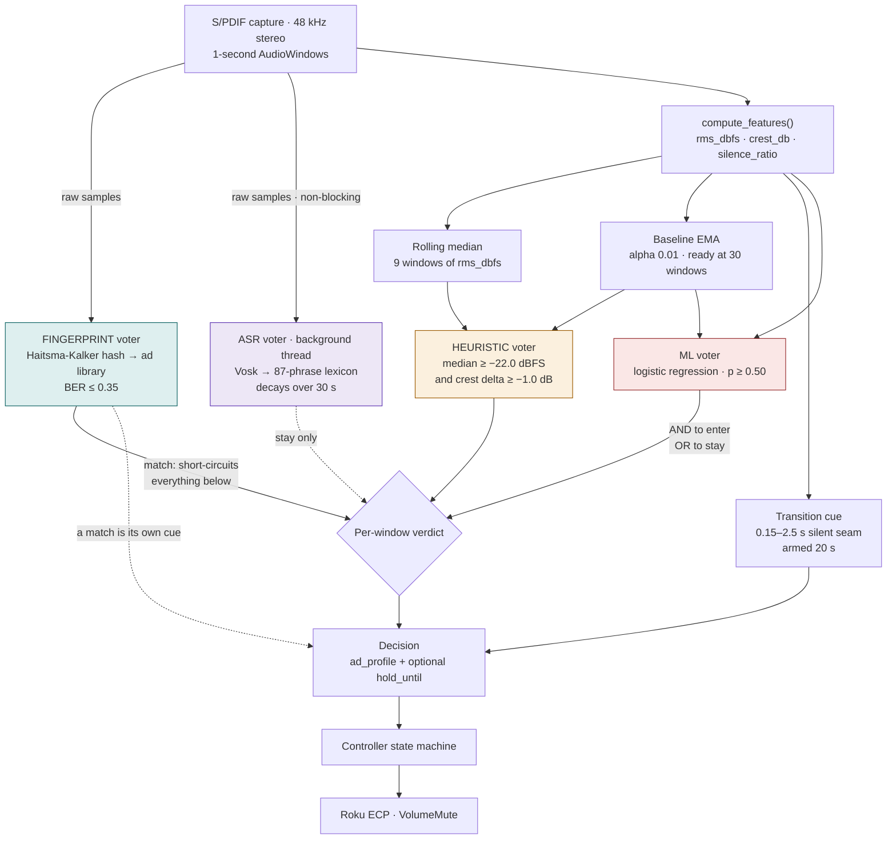
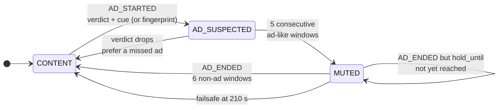

# How admuter decides to mute

One second of audio goes in. Four voters judge it, one state machine decides,
and the TV either stays audible or does not.

The voters do **not** carry equal authority, and that asymmetry is the whole
design. Muting real dialogue is the failure that ruins the experience; missing
an ad merely annoys. So every voter is placed by how much it can be trusted to
be right, and only one of them is trusted enough to start a mute on its own.

## Signal path

## State machine

All memory in the system lives here. No voter can see it, which is why no voter
can desync from it.

The `MUTED → MUTED` self-transition is where fingerprinting pays off: the
acoustic detector says the ad ended, the fingerprint says twelve seconds remain,
and the known duration wins over the guess.

## Who is allowed to do what

| Voter | Can start a mute | Can extend a mute | Knows the end time |
|---|---|---|---|
| Fingerprint | **yes** | yes | **yes** |
| Heuristic | yes, with a cue | yes | no |
| ASR | no | yes | no |
| ML | no — it is a veto | yes | no |

**Fingerprint** short-circuits the others entirely: a match returns true before
the rest are consulted. It is an identity rather than an inference, so it needs
no transition cue and no warmed baseline — it fires on the first window — and it
is the only voter that supplies `hold_until`, letting the controller mute for
the spot's real remaining duration instead of counting quiet windows.

**Heuristic** does the ordinary work, and needs a transition cue to fire.

**ASR** is the dotted line, and reaches only the stay path. Recognition lags the
audio by 10–20 seconds, so by the time words are scored the moment to start a
mute is long gone; entering on it would mute the show a quarter-minute after the
break ended.

**ML** applies `AND` to enter and `OR` to stay, which makes it a veto rather
than a trigger. That placement is deliberate: on leave-one-session-out it scores
0.451 AUC on reality TV, below chance on the genre needing the most help.

## Why there is a fingerprint voter at all

Every other signal here infers whether audio *sounds* like advertising, and that
is exactly what fails on content mastered as hot as its own ads — the reality-TV
session has a 1.05 dB ad-to-content gap with 58% overlap, and no threshold
separates it.

Repetition does. Measured over the annotated corpus: **30.1% of ad audio is a
verbatim repeat of an earlier airing, against 0.0% of content.** Ads repeat,
television does not. Matching the labelled spans in order against only what came
before recognises 13 of 24 spans and 60.2% of all ad audio, with 0 of 20 content
samples falsely matched.

Cold start is per-ad and permanent: a spot's first airing is always missed.

## Where each piece lives

| Path | What it holds |
|---|---|
| `admuter/detector.py` | State machine, heuristic voter, and the vote combination in `_second_opinion()` |
| `admuter/fingerprint.py` | Hashing, index, ad library, repeat detection |
| `admuter/transcript.py` | Lexicon, decay, and the bounded hand-off that drops audio rather than stalling capture |
| `admuter/ml_detector.py` | Model loading, with hard guards against a silent column-order mismatch |
| `admuter/controller.py` | Mute lifecycle, app gate, and the only place raw samples reach the voters |
